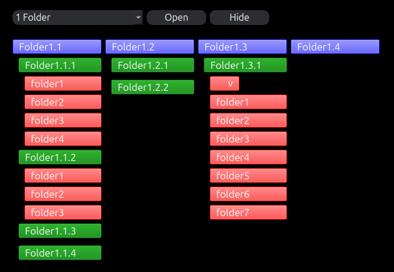

# Compass

Compass is a desktop tool that maps folders and subfolders up to 3 levels, with a dropdown menu for quick selection of the parent directory.

This tool is intended for project management and works best with directory structures in which you have a parent directory of project folders. The dropdown automatically populates with the folders in that parent directory; in this way, you can select which project will be displayed.

Clicking on a folder button will open that folder in the file explorer.

Colors can be adjusted using HTML-compatible color codes.

## Future plans
- Re-organize the code so it's not one gigantic file.
- Incorporate files as well so it's not just folders appearing.
- Add an accordion dropdown for lists of over 6 folders